!SLIDE 
# We wrote a Rails plugin

!SLIDE  smbullets incremental
# Four Parts #

* Acts\_as\_\* ActiveRecord modules
* A data mapping DSL
* Synchronization tracking tables
* Synchronization manager

!SLIDE 
# An Aside #
### Welcome Millennium-vania

!SLIDE bullets
# Synchronization Management #

* Some Rake tasks
* Class to collect methods

!SLIDE bullets
# ActiveRecord

* <code>acts\_as\_millennium</code>
* <code>acts\_as\_millsyncable</code>
<!-- mark ar as pairs -->

!SLIDE 
# acts\_as\_millennium #

    @@@ Ruby
    class Millennium::Payment < Millennium::Base
      acts_as_millennium 
        :associated_object => :person_payment
      belongs_to_corebio_via :payid
    end

!SLIDE 
# acts\_as\_millsyncable #

    @@@ Ruby
    class PersonPayment < ActiveRecord::Base
      acts_as_millsyncable 
        :millennium_class_name => "Payment"         
    end

!SLIDE 
# Data Mapping #

!SLIDE
# Problem:
## Data stored in one database isn't properly formatted for the other

!SLIDE bullets incremental
# For Example #

* Millennium pads strings to fixed length
* Millennium stores timestamps without a time zone

!SLIDE small
# Field pairs #

    @@@ Ruby
    class Millennium::Payment < Millennium::Base
      set_field_pair "Amount", :amount, :paydueamt
    end

!SLIDE small
# Field pairs #

    @@@ Ruby
    set_field_pair "Amount", :amount, :paydueamt
    #              pretty name

!SLIDE small
# Field pairs #

    @@@ Ruby
    set_field_pair "Amount", :amount, :paydueamt
    #                        local column

!SLIDE small
# Field pairs #

    @@@ Ruby
    set_field_pair "Amount", :amount, :paydueamt
    #                                 millennium column

!SLIDE smaller
# Field pairs #

    @@@ Ruby
    set_field_pair "Due Date", :due_on, :payduedate do |field_pair|
      field_pair.millennium_to_app do |record|
        dt = millennium_value(record)
        return nil if dt.nil?
        return Time.utc(dt.year, dt.month, dt.day, dt.hour, dt.min, dt.sec).in_time_zone
      end
  
      field_pair.app_to_millennium do |record|
        dt = app_value(record)
        return nil if dt.nil?
        return dt.utc
      end
    end
<!-- this is complicated but powerful -->

!SLIDE small
# Field pairs #

    @@@ Ruby
    set_field_pair "Due Date", :due_on, :payduedate do |field_pair|
      field_pair.standard_conversion :TimeWithZone
    end
<!-- and can standardize -->

!SLIDE 
# Synchronization Tracking #

!SLIDE bullets
# Scan for missing rows #

* Insert on one side
* Delete on the other
<!-- diagram -->

!SLIDE bullets
# Scan for mismatched fields #

* Translating in both directions first
<!-- diagram -->

!SLIDE bullets
# Both recorded locally

* SynchronizationAdd
* SynchronizationMismatch

!SLIDE bullets incremental
# We resolve what we can #

* Creating matching row for Adds
* Updating older field for Mismatch

!SLIDE bullets incremental
# The rest goes into a DBA interface #

* Yes: a human being approves updates individually
* Required by the client

!SLIDE  full-page
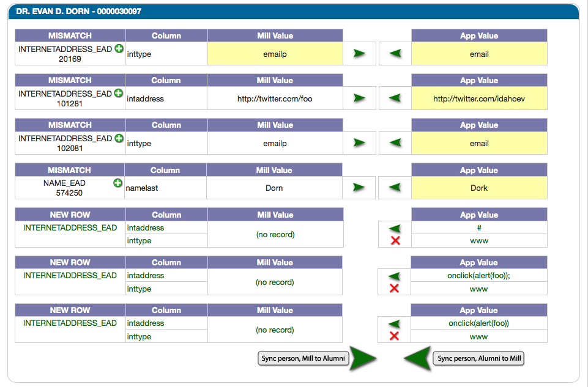

!SLIDE 
# Scan Records

!SLIDE  bullets incremental
# Problem

* Scans of the busy database are long
* Full scan is about 36 hours
* And there's memory leaks

!SLIDE 
# Database scans are long running... #

!SLIDE 
# And fragile...

!SLIDE  full-page
# And valuable... #

!SLIDE
# Database scans are not made of unicorn poop.  
# They just aren't.

!SLIDE bullets incremental
# The key is letting scans be lightweight 

* Keep track of where they are
* Can pick right back up when interupted
* (When, not if)

!SLIDE bullets
# Many advantages

* Who cares about OCI8?
* Iterative scanning easier
* Operations likes it

!SLIDE 
# How's it work?

!SLIDE  full-page
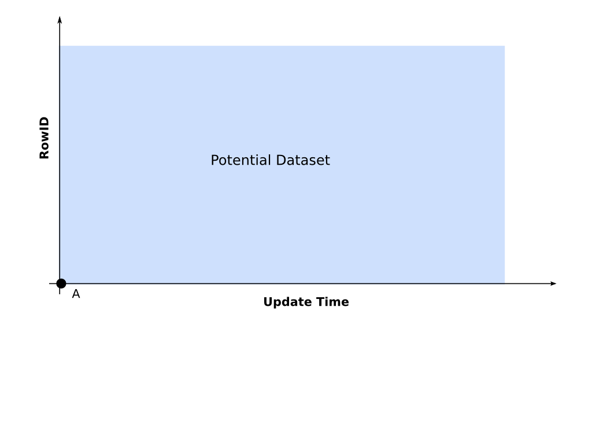

!SLIDE  full-page
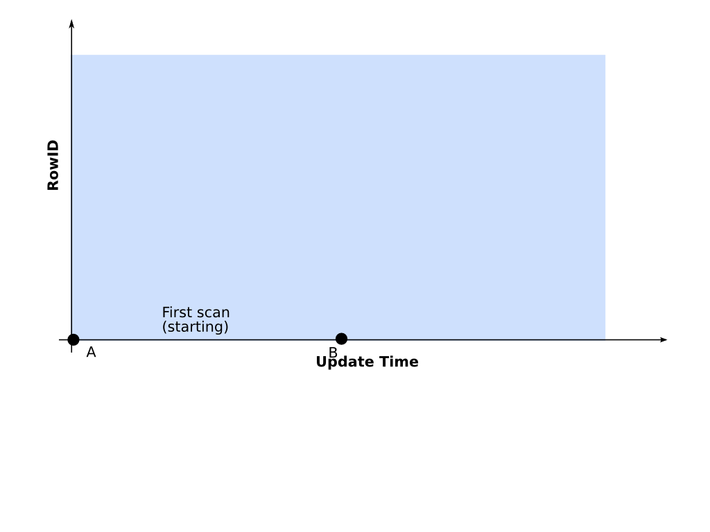

!SLIDE  full-page
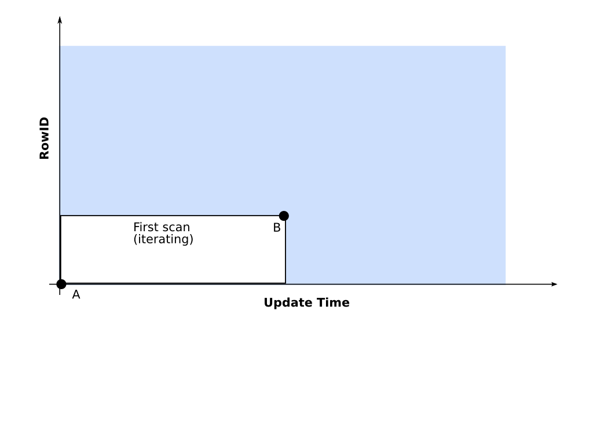

!SLIDE  full-page
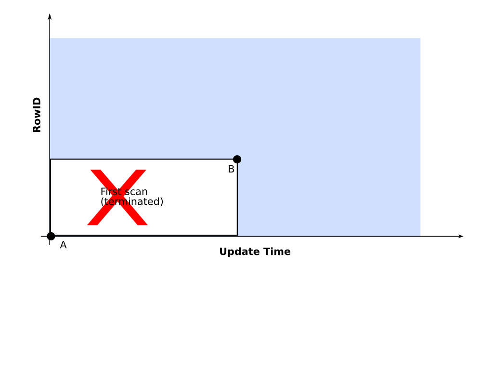

!SLIDE  full-page
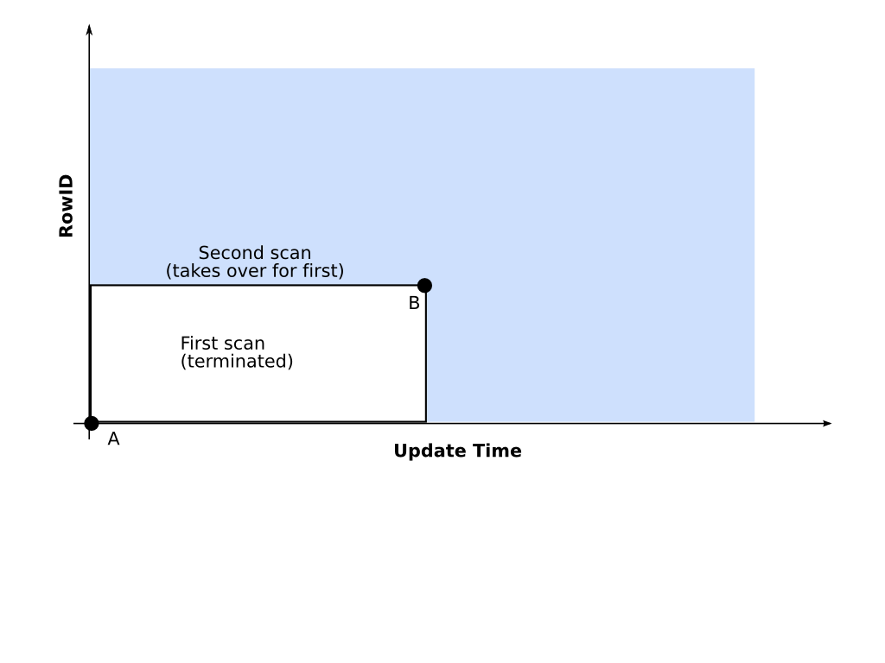

!SLIDE  full-page
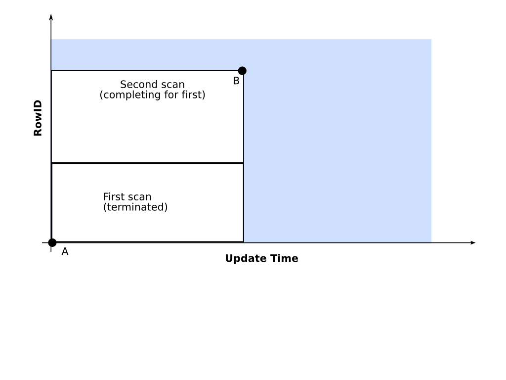

!SLIDE  full-page
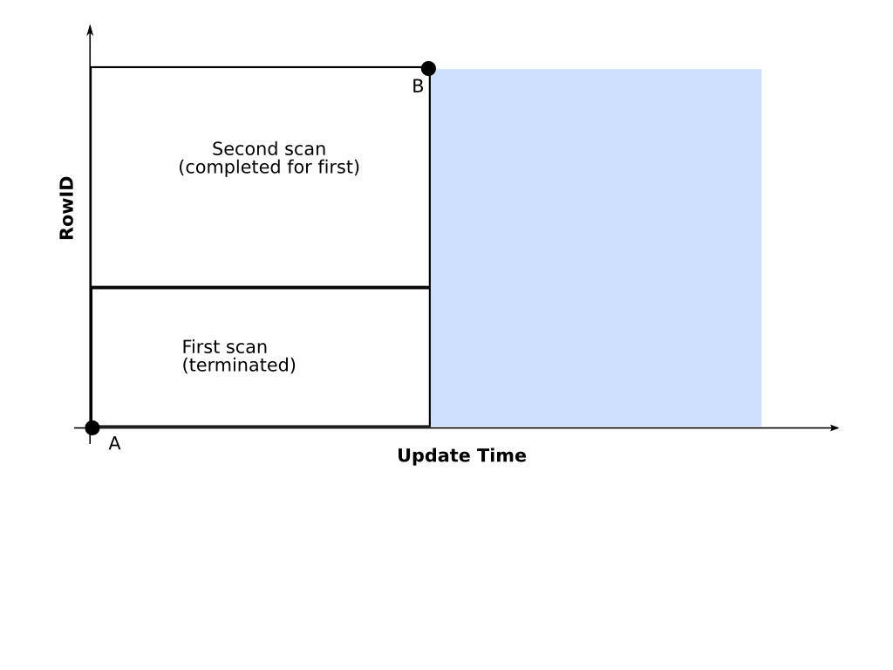

!SLIDE  full-page
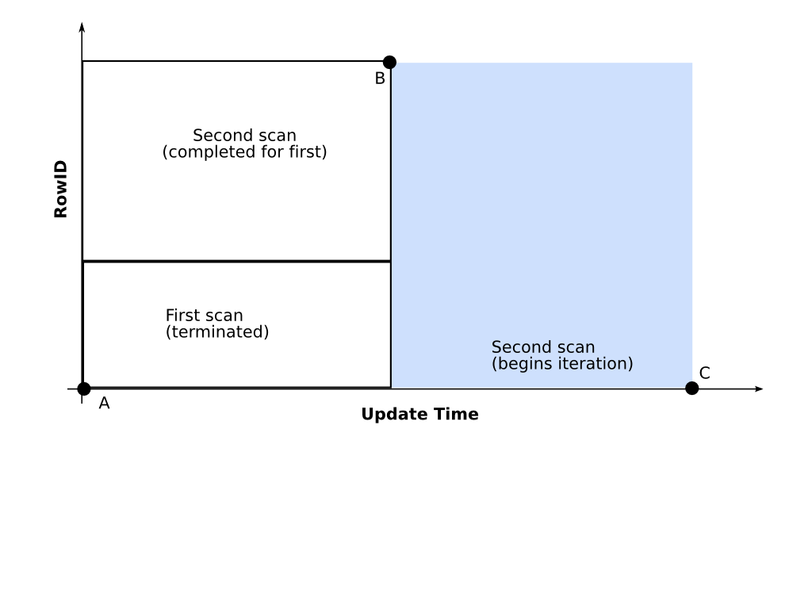

!SLIDE  full-page
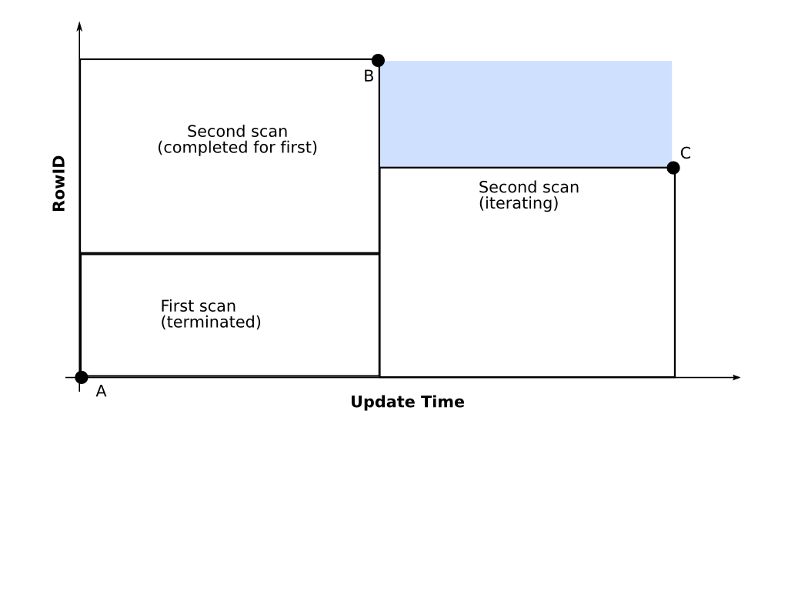

!SLIDE  full-page
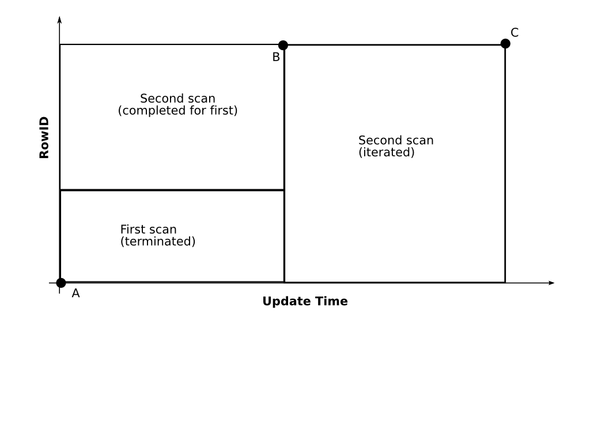

<!-- vim: ft=markdown:fo=:lbr 
Consider :so showoff.vim 
--> 
