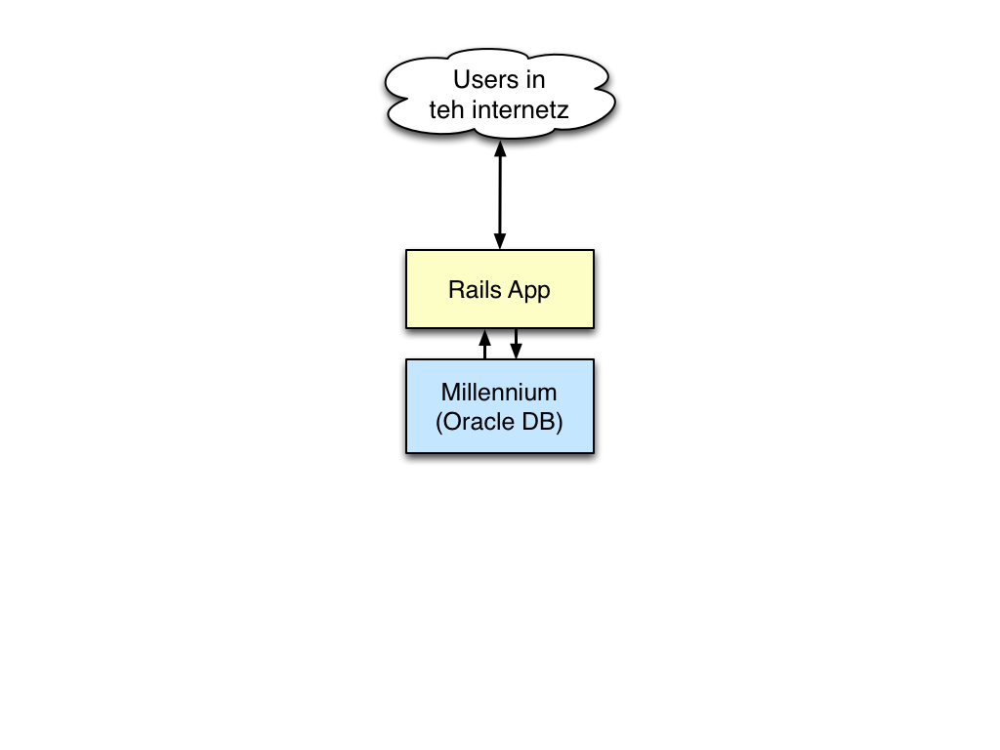
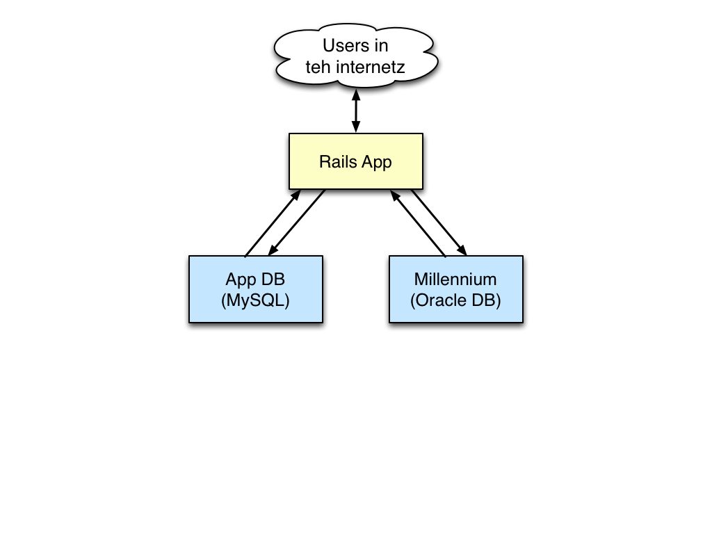
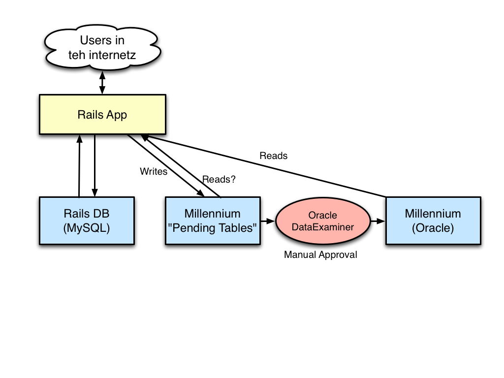
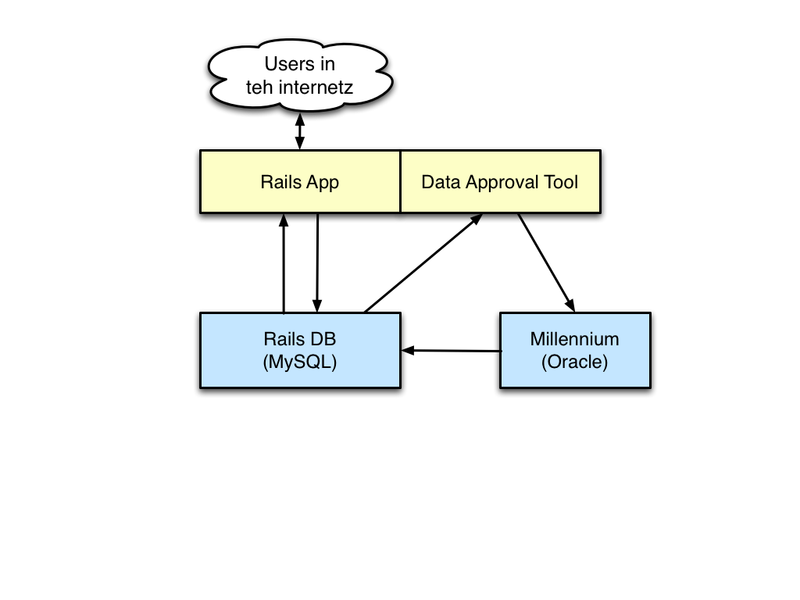

!SLIDE 
# The Task #

!SLIDE 
# Build the Alumni Directory for Caltech 

!SLIDE 
# The Challenge

!SLIDE
# Data must be current with "Millennium"
## (Development Office fundraising DB)

!SLIDE bullets incremental
# Millennium is: #

* 15 years old
* Oracle
* Bad schema
* Atrocious data formatting

!SLIDE
# Option 1: #
## Use Millennium as Site DB 

!SLIDE full-page

!SLIDE bullets incremental
# Problems:

* We need data that Millennium doesn't store:
* Login credentials
* User bios, preferences, images
* News / forums / CMS
* Can't change Mill's schema

!SLIDE bullets incremental
# Option 2:
## App reads/writes two DBs!

!SLIDE full-page

!SLIDE bullets incremental
# Two-DB Problems:
* Can't join between databases
* User bio, privacy, photo in one DB
* All other user info in the other!
* Massive N+1 query problems

!SLIDE bullets incremental
# New Specifications: #
* App cannot write to Millennium!
* Mill writes require manual approval!

!SLIDE bullets incremental
# "Pending Tables"
* Data written to temporary table
* DBA manually approves all writes
* Approved data written to main tables

!SLIDE full-page

!SLIDE bullets incremental
# "Pending Problems"
* Primary key assigned after approval
* Different values in two tables
* Multiple updates generate multiple rows

!SLIDE 
# Option 3:

!SLIDE bullets incremental
# Our DB clones Mill schema, plus ours
* Serve only from our DB
* Two-way sync with approval

!SLIDE full-page

!SLIDE full-page

<!--!SLIDE -->
<!--# The project #-->
<!--We used to use this case as an interview question.  If you're looking for a -->
<!--solid contract job, you might want to listen carefully.-->

<!--We were hired to write a social networking website for alumni of a large -->
<!--university.  The big challenge was that the reference for user data was an -->
<!--atavistic Oracle database.  An Oracle database application.  Which meant that -->
<!--we couldn't make any changes to the schema.  So what could we do?  -->

<!--We needed to be able to have our own data to keep track of features our client -->
<!--wanted.  So, we needed our own separate database.-->

<!--We considered synchronizing the two databases.  But that's insane, right?-->

<!--At first, we considered using two completely different databases.  And there's -->
<!--some sense to that.  Two nice, clean separate resources - ideal.  Consider  -->
<!--doing joins though: suddenly the query takes seconds to return.-->

<!--But the alternative is to do synchronization.  And that's insane, right?  -->
<!--That's what we thought.  Ultimately, we needed to do exactly that.-->

<!--There was an extra requirement: all changes needed to be confirmed by an -->
<!--administrative user.-->
<!-- vim: ft=markdown:fo=:lbr 
Consider :so showoff.vim 
--> 
